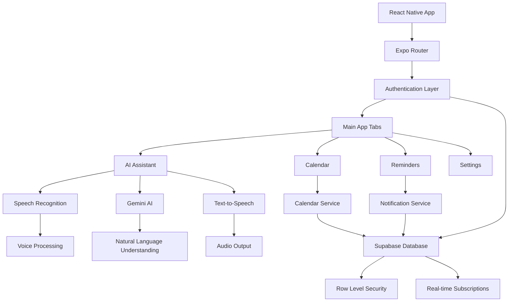

# Aura - AI-Powered Personal Assistant

<div align="center">


*An intelligent, voice-controlled personal assistant app*

[](https://expo.dev/)
[](https://reactnative.dev/)
[](https://www.typescriptlang.org/)
[](https://supabase.com/)

</div>

An intelligent mobile assistant app built with React Native and Expo that provides voice-controlled calendar management, reminders, and smart notifications with cross-platform compatibility. Powered by Google Gemini AI for natural language processing and featuring a modern, responsive UI with dark/light mode support.

## 🌟 Features

### 🎙️ Voice Assistant
- **Natural Language Processing**: Powered by Google Gemini AI for intelligent conversation
- **Cross-Platform Speech Recognition**: Works on Android, iOS, and Web
- **Voice Commands**: Create, update, and delete events/reminders using voice
- **Speech Feedback**: Text-to-speech responses for accessibility

### 📅 Calendar Management
- **Smart Event Creation**: AI-powered event scheduling with natural language
- **Calendar Integration**: Seamless integration with device calendar
- **Conflict Detection**: Intelligent scheduling to avoid overlapping events
- **Event CRUD Operations**: Full create, read, update, delete functionality

### 🔔 Smart Notifications
- **Intelligent Scheduling**: Automated reminder notifications
- **Interactive Notifications**: Reply and interact directly from notifications
- **Background Processing**: Reliable notification delivery
- **Custom Categories**: Organized notification types

### 🎨 User Experience
- **Dark/Light Mode**: Automatic theme switching with system preference
- **Responsive Design**: Optimized for all screen sizes and orientations
- **Smooth Animations**: Polished UI transitions and interactions
- **Error Boundaries**: Graceful error handling with user-friendly messages

### 🔐 Authentication & Security
- **OTP-Based Authentication**: Secure email-based sign-in/sign-up
- **Profile Management**: Customizable user profiles with settings
- **Session Management**: Secure session handling across devices
- **Privacy-First**: No password storage, secure token-based auth

## 🛠️ Tech Stack

| Category | Technology |
|----------|------------|
| **Framework** | React Native with Expo SDK 53 |
| **Navigation** | Expo Router with typed routes |
| **Database** | Supabase (PostgreSQL) with RLS |
| **AI/ML** | Google Gemini Pro API |
| **Speech** | @react-native-voice/voice |
| **Notifications** | expo-notifications |
| **State Management** | Zustand |
| **Styling** | React Native StyleSheet + Custom Theme |
| **Development** | TypeScript, ESLint, Metro |
| **Build/Deploy** | EAS Build, Expo Dev Client |

## 📋 Prerequisites

Before getting started, ensure you have the following installed:

- **Node.js** 18+ ([Download](https://nodejs.org/))
- **Package Manager**: npm, yarn, or pnpm
- **Expo CLI**: Install globally with `npm install -g @expo/cli`
- **Git**: For version control
- **Code Editor**: VS Code recommended with React Native extensions

### For Local Development:
- **Android**: Android Studio + Android SDK 34+ (for Android builds)
- **iOS**: Xcode 15+ and Command Line Tools (macOS only, for iOS builds)
- **EAS Account**: [Sign up](https://expo.dev/) for cloud builds (recommended)

### For Testing:
- **Physical Device**: Expo Go app for quick testing
- **Emulator/Simulator**: Android Virtual Device (AVD) or iOS Simulator

## 🚀 Quick Start

### 1. Clone and Install

```bash
# Clone the repository
git clone <repository-url>
cd Aura

# Install dependencies
npm install
# or
yarn install
```

### 2. Environment Setup

Create a `.env` file in the root directory with the following variables:

```env
# Supabase Configuration
EXPO_PUBLIC_SUPABASE_URL=https://your-project.supabase.co
EXPO_PUBLIC_SUPABASE_ANON_KEY=your_supabase_anon_key

# Google Gemini API
EXPO_PUBLIC_GEMINI_API_KEY=your_gemini_api_key
```

> ⚠️ **Important**: Never commit your `.env` file to version control. Add it to `.gitignore`.

**Getting Your API Keys:**

- **Supabase**: 
  1. Create account at [supabase.com](https://supabase.com)
  2. Create new project
  3. Go to Settings → API to find your URL and anon key
  
- **Google Gemini**: 
  1. Visit [Google AI Studio](https://makersuite.google.com/)
  2. Create API key for Gemini Pro
  3. Enable Generative Language API in Google Cloud Console

### 3. Supabase Database Setup

1. **Create a Supabase project** at [supabase.com](https://supabase.com)

2. **Set up database schema** by running the SQL migrations:
   ```sql
   -- Navigate to Supabase Dashboard → SQL Editor
   -- Copy and execute the SQL from supabase/migrations/ files:
   
   -- 1. First run: 20250629140123_muddy_sound.sql
   -- 2. Then run: fix_delete_policies.sql
   ```

3. **Configure Row Level Security (RLS)**:
   - Tables `profiles`, `events`, `reminders` should have RLS enabled
   - Policies allow users to access only their own data
   - Authentication required for all operations

4. **Test the connection**:
   ```bash
   # Verify connection in your app
   npx expo start
   # Check for connection errors in development tools
   ```

### 4. Google Gemini API Setup

1. **Get API Key** from [Google AI Studio](https://makersuite.google.com/)
2. **Enable APIs** in Google Cloud Console:
   - Generative Language API
   - (Optional) Cloud Translation API for multi-language support
3. **Set usage quotas** to prevent unexpected charges
4. **Test API access**:
   ```bash
   curl -X POST \
     -H "Content-Type: application/json" \
     -d '{"contents":[{"parts":[{"text":"Hello"}]}]}' \
     "https://generativelanguage.googleapis.com/v1beta/models/gemini-pro:generateContent?key=YOUR_API_KEY"
   ```

### 5. Run the App

```bash
# Start development server
npx expo start
# or with yarn
yarn expo start

# Run on specific platforms
npx expo start --android     # Android emulator/device
npx expo start --ios         # iOS simulator/device  
npx expo start --web         # Web browser

# Build and run locally (requires native setup)
npx expo run:android         # Local Android build
npx expo run:ios            # Local iOS build (macOS only)

# Clear cache if needed
npx expo start --clear
```

#### First Time Setup
1. **Install Expo Go** app on your mobile device
2. **Scan QR code** from the terminal
3. **Or use emulator/simulator** for testing
4. **Enable permissions** when prompted (microphone, notifications)

#### Troubleshooting First Run
- If you see metro bundler errors, try `npx expo install --fix`
- For Android: Ensure USB debugging is enabled
- For iOS: Trust the developer certificate in Settings
- For web: Use a modern browser (Chrome, Firefox, Safari)

## 🏗️ Project Structure

```
Aura/
├── 📱 app/                          # App screens (Expo Router)
│   ├── (auth)/                      # Authentication flow
│   │   ├── index.tsx               # Sign-in screen
│   │   └── sign-up.tsx             # Sign-up screen
│   ├── (tabs)/                      # Main app tabs
│   │   ├── index.tsx               # AI Assistant tab
│   │   ├── calendar.tsx            # Calendar management
│   │   ├── reminders.tsx           # Reminders list
│   │   └── settings.tsx            # User settings
│   ├── auth/
│   │   └── confirm.tsx             # OTP confirmation
│   ├── _layout.tsx                 # Root layout with providers
│   ├── index.tsx                   # App entry point
│   └── +not-found.tsx              # 404 error page
│
├── 🧩 components/                   # Reusable UI components
│   └── ErrorBoundary.tsx           # Error boundary component
│
├── 🎨 constants/                    # App constants
│   └── Colors.ts                   # Theme color definitions
│
├── 🪝 hooks/                       # Custom React hooks
│   ├── useColors.ts                # Theme color hook
│   ├── useFrameworkReady.ts        # Framework initialization
│   └── useResponsiveScreen.ts      # Responsive design utilities
│
├── 📚 lib/                         # Core business logic
│   ├── assistantCalendarService.ts # AI calendar operations
│   ├── gemini.ts                   # Google Gemini integration
│   ├── notificationService.ts      # Notification management
│   ├── platformUtils.ts            # Platform-specific utilities
│   ├── speech.ts                   # Text-to-speech service
│   ├── speechRecognition.ts        # Speech-to-text service
│   └── supabase.ts                 # Supabase client
│
├── 🔌 plugins/                     # Expo config plugins
│   └── withAndroidManifestFix.js   # Android build fixes
│
├── 🏪 stores/                      # State management (Zustand)
│   ├── useAuthStore.ts             # Authentication state
│   └── useThemeStore.ts            # Theme state
│
├── 🗄️ supabase/                    # Database schema
│   └── migrations/                 # SQL migration files
│
├── 📝 types/                       # TypeScript definitions
│   ├── database.ts                 # Database types
│   └── web-speech.d.ts            # Speech API types
│
├── 🎯 assets/                      # Static assets
│   └── images/                     # App icons and images
│
├── ⚙️ Configuration Files
├── app.json                        # Expo configuration
├── eas.json                        # EAS Build configuration
├── package.json                    # Dependencies and scripts
├── tsconfig.json                   # TypeScript configuration
└── metro.config.js                 # Metro bundler configuration
```

## 🔧 Development

### Available Scripts

```bash
# Development
yarn dev                    # Start Expo dev server (alias for expo start)
yarn expo start            # Start development server
yarn android               # Run on Android device/emulator
yarn ios                   # Run on iOS device/simulator

# Building & Deployment
yarn build:web             # Build optimized web bundle
yarn lint                  # Run ESLint code analysis

# EAS Build (Cloud Building)
eas build --platform android    # Build Android APK/AAB
eas build --platform ios        # Build iOS IPA
eas build --platform all        # Build for both platforms
eas submit                       # Submit to app stores

# Development Tools
expo doctor                      # Check development environment
expo install --fix              # Fix dependency compatibility
npx expo start --clear          # Clear Metro cache and restart
```

### EAS Build Configuration

The project includes optimized EAS build profiles in `eas.json`:

```json
{
  "build": {
    "development": {
      "developmentClient": true,
      "distribution": "internal"
    },
    "preview": {
      "distribution": "internal",
      "android": { "buildType": "apk" }
    },
    "production": {
      "android": { "buildType": "aab" }
    }
  }
}
```

### Key Development Features

- **Hot Reloading**: Instant code updates during development
- **TypeScript**: Full type safety and IntelliSense
- **Error Boundaries**: Graceful error handling in production
- **Cross-Platform**: Single codebase for Android, iOS, and Web
- **EAS Build**: Cloud-based building and deployment


## 🏛️ Architecture

### System Overview



### Data Flow

1. **User Input** → Voice or text input received
2. **Speech Processing** → Convert speech to text (if voice)
3. **AI Processing** → Gemini AI analyzes intent and entities
4. **Action Execution** → Perform calendar/reminder operations
5. **Database Update** → Store changes in Supabase
6. **UI Update** → Reflect changes in real-time
7. **Notification** → Schedule relevant reminders
8. **Voice Feedback** → Provide audio confirmation


### Security Architecture

- **Authentication**: OTP-based, passwordless authentication
- **Authorization**: Row Level Security (RLS) in Supabase
- **Data Encryption**: HTTPS for all communications
- **Local Storage**: Expo SecureStore for sensitive data
- **API Security**: Environment variables for API keys
- **Input Validation**: Client and server-side validation
